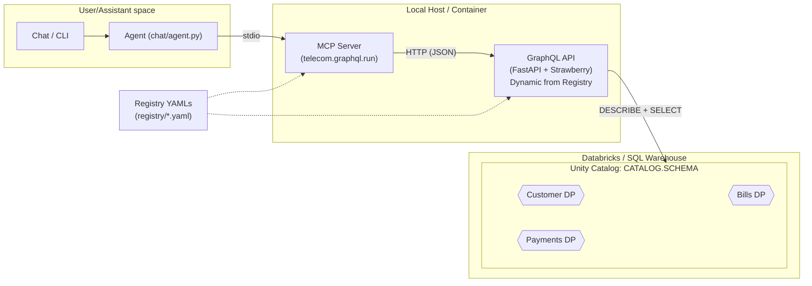
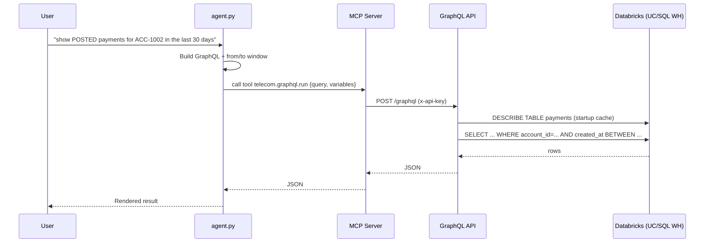

# Telecom Data Products — GraphQL + MCP Architecture (v1)

**Date:** 2025-10-09  
**Scope:** Initial, working end-to-end (E2E) stack to expose Databricks-hosted Telecom Data Products via a metadata-driven GraphQL API, make them agent-invocable through an MCP server, and demo queries with a lightweight agent/CLI.

---

## 1) Goals & Non-Goals

**Goals**
- Keep Data Products (DPs) **inside Databricks** (Unity Catalog / SQL Warehouse).
- Expose DP entities (e.g., `customer_profile`, `bills`, `payments`) via a **schema generated from metadata**, not per-DP code.
- Provide a thin **GraphQL runtime** that compiles queries → SQL with filter pushdown.
- Make the API easily **discoverable/invocable by agents** via **MCP** (Model Context Protocol).
- Include basic **security (API key)** and **observability** (structured logs, correlation IDs, PII redaction).
- Ship a **repeatable dev experience** (Makefile + `.env`).

**Non-Goals (v1)**
- Relationship/nested GraphQL fields (e.g., `bill → payments`) generated from metadata.  
  > *Planned for vNext.*
- Row-level security (RLS) / policy enforcement in the runtime.  
  > *Planned for vNext.*
- Caching/persisted queries, federation/gateway.  
  > *Planned for vNext.*

---

## 2) High-Level Architecture

### 2.1 Components

- **Databricks / Unity Catalog**: Authoritative store for all DP tables.
- **Registry (YAML)**: Declarative DP metadata → drives the GraphQL schema & filters.
- **GraphQL API (FastAPI + Strawberry)**: Builds types/resolvers **at startup** from Registry + table introspection; compiles filters to SQL.
- **MCP Server**: Exposes a tool `telecom.graphql.run` that forwards GraphQL calls to the API (injects base URL + API key).
- **Agent (CLI)**: Minimal chat/CLI that talks to the MCP Server and runs common Telecom asks (payments by account; bill + payments).

### 2.2 Dataflow (DPs live *in* Databricks)



> **Hexagons** = Data Products; all reside within Databricks.

### 2.3 Request Sequence (example)



---

## 3) Registry-First: Metadata Model

Each Data Product contributes a YAML file under `registry/`. Minimum shape:

```yaml
data_product: payments
entities:
  payments:
    table: "${CATALOG}.${SCHEMA}.payments"
    key: payment_id
    filters:
      - { name: account_id, type: STRING, operator: "=" }
      - { name: status,     type: STRING, operator: "=" }
      - { name: bill_id,    type: STRING, operator: "=" }
      - { name: from_time,  type: TIMESTAMP, operator: ">=", column: created_at }
      - { name: to_time,    type: TIMESTAMP, operator: "<=",  column: created_at }
      - { name: q,          type: STRING, operator: "ilike_any", columns: ["payment_id","method","currency"] }
relationships: []
```

- `table` may use `${CATALOG}` / `${SCHEMA}` to avoid hardcoding.
- `filters`: map **GraphQL input** → **SQL where** with operator & (optionally) column override or multi-column `ilike_any`.
- `relationships`: reserved for vNext (generate nested fields like `bill { ... }`, `payments { ... }`).

A similar `customer.yaml` describes `customer_profile`, `customer_accounts`, `customer_subscriptions`, and `bills` (if grouped with customer DP) or you can keep bills in a `payments.yaml`—up to you.

---

## 4) GraphQL Runtime (FastAPI + Strawberry)

**File:** `app/meta_graphql.py`

- **Startup flow**
  1. Load `registry/*.yaml` → normalize shapes (`data_product`, `entities`, `filters`).
  2. For each entity:
     - `DESCRIBE TABLE` to discover columns.
     - Build a **GraphQL object type** with fields = columns (types inferred: `Int/Float/String`).
     - Build a **GraphQL input** type for `filters`.
     - Generate resolvers:
       - `get_<singular>(key: String!) → <Entity>`
       - `list_<entity>(filters, limit, offset) → [<Entity>]`
     - Publish generated classes to module scope (Strawberry requirement).
  3. Assemble the root `Query` type and mount the GraphQL router.

- **Filter compiler**
  - Supports `=, !=, >, >=, <, <=, ilike, ilike_any`.
  - Produces `WHERE ...` with bound params (`:p_name`) and appends `LIMIT/OFFSET`.

- **Endpoints**
  - `/graphql` (protected by API key)
  - `/healthz` → `{ ok: true, mode: "dynamic" }`

- **Auth & Observability**
  - Header `x-api-key` required (set in `.env` as `API_KEY`).
  - Structured logs with `x-correlation-id` (auto-generated if missing).
  - Basic PII redaction for email/phone patterns in logged request bodies.

---

## 5) MCP Server

**Tool exposed:** `telecom.graphql.run`  
**Args:** `{ query: string, variables: object }`  
**Behavior:** Forwards to the GraphQL API at `${TELECOM_API_BASE}${TELECOM_GQL_PATH}` and injects header `x-api-key: ${TELECOM_API_KEY}`.  
**Resources (optional/vNext):** publish `/registry/index`, GraphQL SDL, OpenAPI specs per DP to help agent discovery.

---

## 6) Agent (CLI)

**File:** `chat/agent.py`

- Talks to MCP server (stdio), invokes `telecom.graphql.run`.
- **NL → GraphQL** quick intents:
  - “show POSTED payments for **ACC-XXXX** in the last **N** days”
  - “get bill **BILL-XXXX** and list its payments”
- **Sanitizer:** if the same operation includes `get_bill(key:$v)` and `list_payments(...account_id:$v...)`, the agent **rewrites** it to `bill_id:$v` (because payments has a `bill_id` column).
- Computes a UTC time window from phrases (“last 30 days”) and injects `$from/$to`.

---

## 7) Repo Layout (minimum)

```
.
├─ app/
│  ├─ main.py                # mounts dynamic GraphQL at /graphql; auth+logs+health
│  └─ meta_graphql.py        # metadata-driven schema/resolvers
├─ registry/
│  ├─ payments.yaml          # DP metadata (example)
│  └─ customer.yaml          # DP metadata (example)
├─ mcp_server/
│  └─ server.py              # FastMCP server exposing telecom.graphql.run
├─ chat/
│  └─ agent.py               # CLI/agent using MCP tool
├─ Makefile                  # install, run-graphql, mcp-call, demo, print-env
├─ .env                      # Databricks + API key + catalog/schema
└─ requirements.txt          # (optional) python deps
```

---

## 8) Configuration

**`.env` (example)**

```
# Databricks
DATABRICKS_HOST=XXXXXXXX
DATABRICKS_HTTP_PATH=/sql/1.0/warehouses/XXXX
DATABRICKS_TOKEN=XXXXXXXX

# Catalog/Schema (used in registry table strings)
CATALOG=india_dataengineer_recruitment
SCHEMA=telco_silver

# API guard for GraphQL
API_KEY=dev-key

# Agent/MCP (client-side)
API_BASE=http://localhost:8080
GQL_PATH=/graphql
```

---

## 9) Developer Workflow

```bash
# 1) Install
make install

# 2) Start GraphQL API (reads .env + registry; builds dynamic schema)
make run-graphql

# 3) Quick health
curl -s http://localhost:8080/healthz
# → {"ok":true,"mode":"dynamic"}

# 4) Introspection (requires x-api-key)
curl -s -H "x-api-key: $API_KEY" -H "Content-Type: application/json"   -d '{"query":"{ __schema { queryType { fields { name } } } }"}'   "$API_BASE$GQL_PATH" | jq

# 5) Query examples
curl -s -H "x-api-key: $API_KEY" -H "Content-Type: application/json"   -d '{"query":"{ list_payments(limit:5){ payment_id amount status created_at } }"}'   "$API_BASE$GQL_PATH" | jq
```

**MCP one-shot (tool)**
```bash
TELECOM_API_BASE=$API_BASE TELECOM_GQL_PATH=$GQL_PATH TELECOM_API_KEY=$API_KEY python mcp_call.py
```

**Demo (agent via MCP)**
```bash
make demo
# 1) show POSTED payments for ACC-1002 in the last 30 days
# 2) get bill BILL-9001 and list its payments
```

---

## 10) Known Limitations (v1)

- **No nested relationship fields** yet (e.g., `bill { payments { ... } }`).  
  *Workaround*: two separate queries (agent supports this) or filter by `bill_id`.
- **No RLS/policy enforcement** in the runtime; relies on API key.  
  *Workaround*: restrict SQL warehouse access and per-env keys.
- **No caching/persisted queries**.  
  *Workaround*: rely on UC/warehouse performance and small `limit`s.

---

## 11) Level-Up Roadmap

1. **Relationships** (from `relationships:` in YAML) → generate nested resolvers.
2. **Policy/RLS** (metadata-driven): enforce predicates per entity, mask columns, require time windows & max limits.
3. **Discoverability**: publish `/registry/index`, GraphQL SDL, OpenAPI via MCP resources; add a `telecom.schema.help` tool.
4. **Generic agent planner**: introspect schema/registry at runtime and build queries for *any* entity/filters; synonyms mapping.
5. **Observability++**: slow query logging, SQL EXPLAIN sampling, metrics.
6. **Performance**: caching (DESCRIBE + hot queries), persisted queries, edge cache.
7. **Federation/gateway**: if DPs split into services, keep registry as the single source of truth and federate types.

---

## 12) Design Decisions (Why this shape)

- **GraphQL over direct SQL**: strong, stable contract for agents & apps; schema is self-documenting; filters controlled by metadata (safer than freeform SQL).
- **Registry-first**: zero per-DP code (beyond YAML + tables); onboarding new entities is declarative.
- **MCP tool**: standardized way for *any* agent to discover/invoke the API with baked-in auth.
- **.env + Makefile**: repeatable local runs; portable across machines.

---

## 13) Appendix: Minimal Registry Examples

**`registry/payments.yaml`**
```yaml
data_product: payments
entities:
  payments:
    table: "${CATALOG}.${SCHEMA}.payments"
    key: payment_id
    filters:
      - { name: account_id, type: STRING, operator: "=" }
      - { name: status,     type: STRING, operator: "=" }
      - { name: bill_id,    type: STRING, operator: "=" }
      - { name: from_time,  type: TIMESTAMP, operator: ">=", column: created_at }
      - { name: to_time,    type: TIMESTAMP, operator: "<=",  column: created_at }
      - { name: q,          type: STRING, operator: "ilike_any", columns: ["payment_id","method","currency"] }
relationships: []
```

**`registry/customer.yaml`**
```yaml
data_product: customer
entities:
  customer_profile:
    table: "${CATALOG}.${SCHEMA}.customer_profile"
    key: customer_id
    filters:
      - { name: customer_id, type: STRING, operator: "=" }
      - { name: full_name,   type: STRING, operator: "ilike", column: full_name }
      - { name: q,           type: STRING, operator: "ilike_any", columns: ["customer_id","full_name","email"] }

  customer_accounts:
    table: "${CATALOG}.${SCHEMA}.customer_accounts"
    key: account_id
    filters:
      - { name: account_id, type: STRING, operator: "=" }
      - { name: customer_id, type: STRING, operator: "=" }

  bills:
    table: "${CATALOG}.${SCHEMA}.bills"
    key: bill_id
    filters:
      - { name: bill_id,    type: STRING, operator: "=" }
      - { name: account_id, type: STRING, operator: "=" }
      - { name: status,     type: STRING, operator: "=" }
      - { name: from_time,  type: TIMESTAMP, operator: ">=", column: bill_date }
      - { name: to_time,    type: TIMESTAMP, operator: "<=",  column: bill_date }
relationships: []
```

