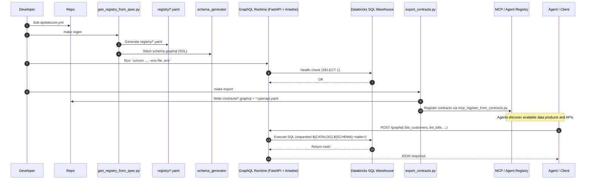
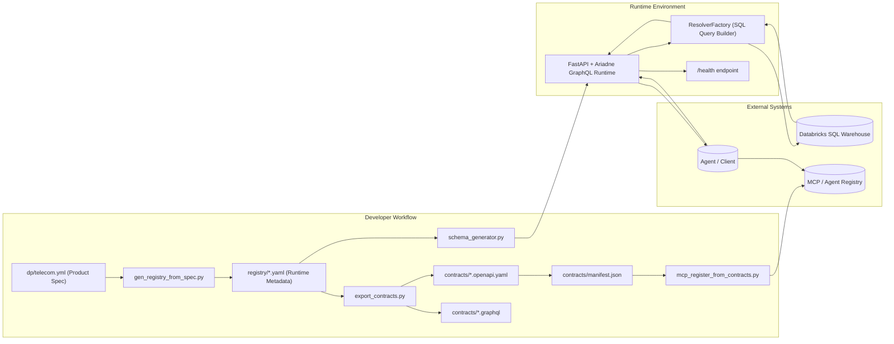

# 📊 GraphQL Data Product Runtime — Architecture & Dataflow

This document provides a **visual overview** of the runtime’s architecture and dataflow using **Mermaid diagrams**, ready for inclusion in documentation portals or Markdown renderers that support Mermaid.

---

## 🔁 End-to-End Dataflow

---

## 🧩 Component Architecture Overview

---

## 🧠 Design Principles

1. **Spec-Driven Automation:**
   - Single YAML spec (`dp/telecom.yml`) defines entities, relationships, and filters.
   - No per-product Python code needed.

2. **Runtime Composition:**
   - Registry → Schema → Runtime → Contracts are all derived dynamically.
   - GraphQL schema built using Ariadne from registry metadata.

3. **Execution Model:**
   - Resolvers auto-generate SQL (templated `${CATALOG}.${SCHEMA}` references resolved at runtime).
   - Databricks SQL Warehouse serves as the live backend.

4. **Contract Management:**
   - `export_contracts.py` produces GraphQL SDL & OpenAPI specs.
   - Contracts registered to MCP for agent discovery.

5. **Observability:**
   - `/health` endpoint validates environment variables and Databricks connectivity.
   - Future: add metrics for query latency & row counts.

---

## ⚙️ Typical Command Flow

| Stage | Command | Outcome |
|--------|----------|----------|
| Spec → Registry | `make regen` | Generates `registry/*.yaml` and validates schema |
| Start Runtime | `uvicorn app.graphql_runtime_app:app --reload --env-file .env` | Launches GraphQL API runtime |
| Export Contracts | `make export` | Produces `.graphql` and `.openapi.yaml` contracts |
| Register to MCP | `make register` | Posts product metadata to MCP registry |
| Query Test | `python scripts/test_query.py` | Verifies end-to-end Databricks → GraphQL flow |

---

## 🧩 Components Summary

| Component | Description |
|------------|-------------|
| **dp/telecom.yml** | Source spec for defining data products and entities |
| **gen_registry_from_spec.py** | Translates spec to runtime registry YAMLs |
| **schema_generator.py** | Builds GraphQL schema (SDL) dynamically |
| **graphql_runtime_app.py** | Starts runtime app using FastAPI + Ariadne |
| **resolver_factory.py** | Converts GraphQL requests → Databricks SQL queries |
| **export_contracts.py** | Emits OpenAPI + SDL contracts for each product |
| **mcp_register_from_contracts.py** | Registers contracts into MCP registry |
| **mock_mcp.py** | Lightweight mock MCP registry for local demo |

---

✅ **Outcome:** Fully metadata-driven GraphQL runtime, contract-aware, and MCP-registrable — with zero manual coding per data product.

**End of file — architecture_and_dataflow.md**