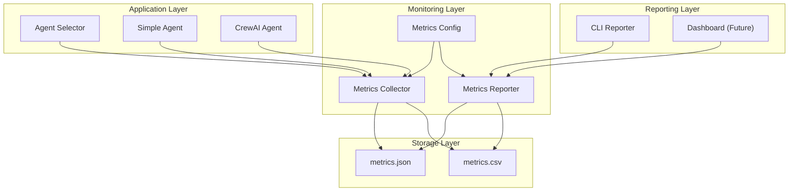

# Performance Monitoring & Metrics System

## Overview

The Telecom Data Product system includes a comprehensive performance monitoring and metrics collection system that provides real-time insights into system performance, agent usage, and query characteristics.

---

## Architecture

### Components



### Metrics Flow

1. **Collection**: Agents record metrics during query processing
2. **Storage**: Metrics stored in JSON and CSV formats
3. **Analysis**: Reporter analyzes metrics and generates insights
4. **Reporting**: CLI and dashboard provide access to metrics

---

## Metrics Collection

### Core Metrics

#### 1. Query Metrics
```python
class QueryMetrics:
    query_id: str
    user_input: str
    agent_type: str  # "simple" or "crewai"
    start_time: datetime
    end_time: datetime
    duration_ms: int
    success: bool
    error_type: Optional[str]
    error_message: Optional[str]
    result_size_bytes: int
```

#### 2. Agent Selection Metrics
```python
class AgentSelectionMetrics:
    query_id: str
    user_input: str
    selected_agent: str
    complexity_score: float
    selection_reason: str
    timestamp: datetime
```

#### 3. Tool Usage Metrics
```python
class ToolUsageMetrics:
    query_id: str
    tool_name: str
    tool_calls_count: int
    graphql_queries_count: int
    entities_detected: List[str]
    timestamp: datetime
```

### Collection Implementation

#### Metrics Collector (`monitoring/metrics_collector.py`)
```python
class MetricsCollector:
    def __init__(self):
        self.metrics = []
        self.config = MetricsConfig()
    
    def start_query(self, user_input: str, agent_type: str) -> str:
        """Start tracking a new query and return query ID"""
        query_id = str(uuid.uuid4())
        self.metrics.append({
            'query_id': query_id,
            'user_input': user_input,
            'agent_type': agent_type,
            'start_time': datetime.now(),
            'status': 'running'
        })
        return query_id
    
    def finish_query(self, query_id: str, success: bool, 
                    result_size_bytes: int = 0, 
                    error_type: str = None, 
                    error_message: str = None):
        """Finish tracking a query with results"""
        for metric in self.metrics:
            if metric['query_id'] == query_id:
                metric.update({
                    'end_time': datetime.now(),
                    'duration_ms': (datetime.now() - metric['start_time']).total_seconds() * 1000,
                    'success': success,
                    'result_size_bytes': result_size_bytes,
                    'error_type': error_type,
                    'error_message': error_message,
                    'status': 'completed'
                })
                break
    
    def record_agent_selection(self, query_id: str, agent_type: str, 
                             complexity_score: float, reason: str):
        """Record agent selection decision"""
        self.metrics.append({
            'type': 'agent_selection',
            'query_id': query_id,
            'selected_agent': agent_type,
            'complexity_score': complexity_score,
            'selection_reason': reason,
            'timestamp': datetime.now()
        })
    
    def record_tool_call(self, query_id: str):
        """Record a tool call"""
        for metric in self.metrics:
            if metric['query_id'] == query_id:
                metric['tool_calls'] = metric.get('tool_calls', 0) + 1
                break
    
    def record_graphql_query(self, query_id: str):
        """Record a GraphQL query execution"""
        for metric in self.metrics:
            if metric['query_id'] == query_id:
                metric['graphql_queries'] = metric.get('graphql_queries', 0) + 1
                break
    
    def record_entities_detected(self, query_id: str, entities: List[str]):
        """Record entities detected in query"""
        for metric in self.metrics:
            if metric['query_id'] == query_id:
                metric['entities_detected'] = entities
                break
```

---

## Metrics Storage

### JSON Format (`metrics.json`)
```json
{
  "queries": [
    {
      "query_id": "123e4567-e89b-12d3-a456-426614174000",
      "user_input": "show me all customers in India with unpaid bills and their payment history",
      "agent_type": "crewai",
      "start_time": "2025-10-15T06:30:00.000Z",
      "end_time": "2025-10-15T06:30:45.000Z",
      "duration_ms": 45000,
      "success": true,
      "result_size_bytes": 2048,
      "tool_calls": 3,
      "graphql_queries": 2,
      "entities_detected": ["customers", "bills", "payments"]
    }
  ],
  "agent_selections": [
    {
      "query_id": "123e4567-e89b-12d3-a456-426614174000",
      "selected_agent": "crewai",
      "complexity_score": 0.85,
      "selection_reason": "Multiple entities detected with complex patterns",
      "timestamp": "2025-10-15T06:30:00.000Z"
    }
  ]
}
```

### CSV Format (`metrics.csv`)
```csv
timestamp,query_id,agent_type,duration_ms,success,entities_detected,tool_calls,graphql_queries
2025-10-15T06:30:00.000Z,123e4567-e89b-12d3-a456-426614174000,crewai,45000,true,"customers,bills,payments",3,2
2025-10-15T06:31:00.000Z,456e7890-e89b-12d3-a456-426614174001,simple,2500,true,"payments",1,1
```

---

## Metrics Analysis

### Metrics Reporter (`monitoring/metrics_reporter.py`)
```python
class MetricsReporter:
    def __init__(self, metrics_file: str = "monitoring/metrics.json"):
        self.metrics_file = metrics_file
        self.metrics = self._load_metrics()
    
    def generate_summary_report(self, hours: int = 1) -> str:
        """Generate a comprehensive summary report"""
        cutoff_time = datetime.now() - timedelta(hours=hours)
        recent_metrics = self._filter_recent_metrics(cutoff_time)
        
        report = []
        report.append("📊 Performance Metrics Summary Report")
        report.append("=" * 50)
        report.append(f"📅 Period: Last {hours} hours")
        report.append(f"🕐 Generated: {datetime.now().isoformat()}")
        report.append("")
        
        # Query statistics
        total_queries = len(recent_metrics)
        successful_queries = sum(1 for m in recent_metrics if m.get('success', False))
        success_rate = (successful_queries / total_queries * 100) if total_queries > 0 else 0
        
        report.append("📈 Query Statistics:")
        report.append(f"  • Total Queries: {total_queries}")
        report.append(f"  • Success Rate: {success_rate:.1f}%")
        report.append(f"  • Failed Queries: {total_queries - successful_queries}")
        report.append("")
        
        # Agent usage
        agent_usage = self._calculate_agent_usage(recent_metrics)
        report.append("🤖 Agent Usage:")
        for agent, count in agent_usage.items():
            percentage = (count / total_queries * 100) if total_queries > 0 else 0
            report.append(f"  • {agent.title()} Agent: {count} queries ({percentage:.1f}%)")
        report.append("")
        
        # Response times
        response_times = self._calculate_response_times(recent_metrics)
        report.append("⏱️  Response Times:")
        report.append(f"  • Average: {response_times['average']:.0f}ms")
        report.append(f"  • Range: {response_times['min']:.0f}ms - {response_times['max']:.0f}ms")
        report.append(f"  • Slow Queries (>5s): {response_times['slow_count']}")
        report.append(f"  • Very Slow Queries (>30s): {response_times['very_slow_count']}")
        report.append("")
        
        # Entity detection
        entity_usage = self._calculate_entity_usage(recent_metrics)
        report.append("🏷️  Entity Detection:")
        for entity, count in entity_usage.items():
            report.append(f"  • {entity}: {count}")
        report.append("")
        
        # Complexity analysis
        complexity_stats = self._calculate_complexity_stats(recent_metrics)
        report.append("🧠 Complexity Analysis:")
        report.append(f"  • Average Complexity Score: {complexity_stats['average']:.3f}")
        report.append(f"  • High Complexity Queries: {complexity_stats['high_complexity']}")
        report.append("")
        
        return "\n".join(report)
    
    def _calculate_agent_usage(self, metrics: List[dict]) -> dict:
        """Calculate agent usage statistics"""
        agent_counts = {}
        for metric in metrics:
            agent_type = metric.get('agent_type', 'unknown')
            agent_counts[agent_type] = agent_counts.get(agent_type, 0) + 1
        return agent_counts
    
    def _calculate_response_times(self, metrics: List[dict]) -> dict:
        """Calculate response time statistics"""
        durations = [m.get('duration_ms', 0) for m in metrics if m.get('duration_ms')]
        if not durations:
            return {'average': 0, 'min': 0, 'max': 0, 'slow_count': 0, 'very_slow_count': 0}
        
        return {
            'average': sum(durations) / len(durations),
            'min': min(durations),
            'max': max(durations),
            'slow_count': sum(1 for d in durations if d > 5000),
            'very_slow_count': sum(1 for d in durations if d > 30000)
        }
    
    def _calculate_entity_usage(self, metrics: List[dict]) -> dict:
        """Calculate entity usage statistics"""
        entity_counts = {}
        for metric in metrics:
            entities = metric.get('entities_detected', [])
            for entity in entities:
                entity_counts[entity] = entity_counts.get(entity, 0) + 1
        return entity_counts
    
    def _calculate_complexity_stats(self, metrics: List[dict]) -> dict:
        """Calculate complexity statistics"""
        complexity_scores = []
        high_complexity = 0
        
        for metric in metrics:
            if 'complexity_score' in metric:
                score = metric['complexity_score']
                complexity_scores.append(score)
                if score > 0.7:
                    high_complexity += 1
        
        return {
            'average': sum(complexity_scores) / len(complexity_scores) if complexity_scores else 0,
            'high_complexity': high_complexity
        }
```

---

## CLI Interface

### Command-Line Interface (`monitoring/cli.py`)
```python
import click
from .metrics_reporter import MetricsReporter

@click.group()
def cli():
    """Performance monitoring CLI"""
    pass

@cli.command()
@click.option('--hours', default=1, help='Number of hours to analyze')
@click.option('--format', default='text', type=click.Choice(['text', 'json', 'csv']))
def report(hours: int, format: str):
    """Generate performance report"""
    reporter = MetricsReporter()
    
    if format == 'text':
        report = reporter.generate_summary_report(hours)
        click.echo(report)
    elif format == 'json':
        data = reporter.get_metrics_data(hours)
        click.echo(json.dumps(data, indent=2))
    elif format == 'csv':
        csv_data = reporter.get_metrics_csv(hours)
        click.echo(csv_data)

@cli.command()
@click.option('--hours', default=24, help='Number of hours to analyze')
def stats(hours: int):
    """Show detailed statistics"""
    reporter = MetricsReporter()
    stats = reporter.get_detailed_stats(hours)
    
    click.echo("📊 Detailed Statistics")
    click.echo("=" * 30)
    click.echo(f"Period: Last {hours} hours")
    click.echo("")
    
    for category, data in stats.items():
        click.echo(f"{category}:")
        for key, value in data.items():
            click.echo(f"  {key}: {value}")
        click.echo("")

@cli.command()
@click.option('--output', default='metrics_export.json', help='Output file')
@click.option('--hours', default=24, help='Number of hours to export')
def export(output: str, hours: int):
    """Export metrics to file"""
    reporter = MetricsReporter()
    data = reporter.get_metrics_data(hours)
    
    with open(output, 'w') as f:
        json.dump(data, f, indent=2, default=str)
    
    click.echo(f"Metrics exported to {output}")

@cli.command()
def config():
    """Show monitoring configuration"""
    from .config import MetricsConfig
    config = MetricsConfig()
    
    click.echo("📋 Monitoring Configuration")
    click.echo("=" * 30)
    click.echo(f"Metrics File: {config.metrics_file}")
    click.echo(f"CSV File: {config.csv_file}")
    click.echo(f"Retention Days: {config.retention_days}")
    click.echo(f"Slow Query Threshold: {config.slow_query_threshold_ms}ms")
    click.echo(f"Very Slow Query Threshold: {config.very_slow_query_threshold_ms}ms")

if __name__ == '__main__':
    cli()
```

### Usage Examples

```bash
# Generate summary report for last hour
python -m monitoring.cli report --hours 1

# Generate detailed statistics for last 24 hours
python -m monitoring.cli stats --hours 24

# Export metrics to JSON file
python -m monitoring.cli export --output metrics_backup.json --hours 48

# Show configuration
python -m monitoring.cli config

# Generate report in JSON format
python -m monitoring.cli report --format json --hours 1
```

---

## Integration Points

### Agent Integration

#### Simple Agent Integration
```python
class SimpleAgent:
    def __init__(self, api_base: str = None, api_key: str = None):
        self.metrics_collector = get_metrics_collector()
    
    def process_query(self, user_input: str) -> str:
        query_id = self.metrics_collector.start_query(user_input, "simple")
        try:
            # Process query...
            result = self._execute_query(user_input)
            
            # Record success metrics
            self.metrics_collector.finish_query(
                query_id, 
                success=True, 
                result_size_bytes=len(result)
            )
            return result
        except Exception as e:
            # Record failure metrics
            self.metrics_collector.finish_query(
                query_id, 
                success=False, 
                error_type=type(e).__name__, 
                error_message=str(e)
            )
            raise
```

#### CrewAI Agent Integration
```python
class CrewAIAgent:
    def __init__(self, api_base: str = None, api_key: str = None):
        self.metrics_collector = get_metrics_collector()
    
    def process_query(self, user_input: str) -> str:
        query_id = self.metrics_collector.start_query(user_input, "crewai")
        try:
            # Detect entities
            entities = self._detect_entities(user_input)
            self.metrics_collector.record_entities_detected(query_id, entities)
            
            # Execute CrewAI workflow
            result = self.crew.kickoff(inputs={"user_query": user_input})
            
            # Record tool usage
            tool_calls = self._count_tool_calls(result)
            graphql_queries = self._count_graphql_queries(result)
            
            for _ in range(tool_calls):
                self.metrics_collector.record_tool_call(query_id)
            for _ in range(graphql_queries):
                self.metrics_collector.record_graphql_query(query_id)
            
            # Record success
            self.metrics_collector.finish_query(
                query_id, 
                success=True, 
                result_size_bytes=len(str(result))
            )
            return result
        except Exception as e:
            self.metrics_collector.finish_query(
                query_id, 
                success=False, 
                error_type=type(e).__name__, 
                error_message=str(e)
            )
            raise
```

#### Agent Selector Integration
```python
class AgentSelector:
    def __init__(self):
        self.metrics_collector = get_metrics_collector()
    
    def select_agent(self, user_input: str) -> str:
        # Calculate complexity score
        complexity_score = self._calculate_complexity_score(user_input)
        
        # Select agent
        if self._is_simple_query(user_input):
            selected_agent = "simple"
            reason = "Simple query pattern detected"
        else:
            selected_agent = "crewai"
            reason = "Complex query pattern detected"
        
        # Record selection
        self.metrics_collector.record_agent_selection(
            user_input, 
            selected_agent, 
            complexity_score, 
            reason
        )
        
        return selected_agent
```

---

## Configuration

### Metrics Configuration (`monitoring/config.py`)
```python
from dataclasses import dataclass
from typing import Optional

@dataclass
class MetricsConfig:
    """Configuration for metrics collection and reporting"""
    
    # File paths
    metrics_file: str = "monitoring/metrics.json"
    csv_file: str = "monitoring/metrics.csv"
    
    # Retention settings
    retention_days: int = 30
    
    # Performance thresholds
    slow_query_threshold_ms: int = 5000
    very_slow_query_threshold_ms: int = 30000
    
    # Collection settings
    enable_entity_detection: bool = True
    enable_tool_tracking: bool = True
    enable_complexity_scoring: bool = True
    
    # Reporting settings
    default_report_hours: int = 1
    max_report_hours: int = 168  # 1 week
    
    # Export settings
    export_formats: list = None
    
    def __post_init__(self):
        if self.export_formats is None:
            self.export_formats = ['json', 'csv', 'text']
```

---

## Performance Impact

### Overhead Analysis

| Component | Memory Overhead | CPU Overhead | Storage Overhead |
|-----------|----------------|--------------|------------------|
| Metrics Collection | ~1MB per 1000 queries | <1% | ~10KB per query |
| JSON Storage | ~2MB per 1000 queries | <2% | ~20KB per query |
| CSV Storage | ~1MB per 1000 queries | <1% | ~5KB per query |
| Reporting | ~5MB per report | ~5% | N/A |

### Optimization Strategies

1. **Batch Processing**: Collect metrics in batches to reduce I/O overhead
2. **Async Storage**: Use asynchronous file operations for non-blocking storage
3. **Compression**: Compress stored metrics to reduce disk usage
4. **Retention Policies**: Automatically clean up old metrics
5. **Sampling**: Sample metrics for high-volume scenarios

---

## Future Enhancements

### 1. Real-Time Dashboards
- **Web-based dashboard**: Real-time performance visualization
- **Alerting system**: Proactive issue detection and notification
- **Custom metrics**: User-defined performance indicators

### 2. Advanced Analytics
- **Trend analysis**: Performance trends over time
- **Predictive analytics**: Forecast performance and capacity needs
- **Anomaly detection**: Identify unusual patterns and issues

### 3. Integration Enhancements
- **Prometheus integration**: Export metrics to Prometheus
- **Grafana dashboards**: Rich visualization and alerting
- **APM integration**: Integration with application performance monitoring tools

### 4. Machine Learning
- **Performance prediction**: Predict query performance based on characteristics
- **Optimization recommendations**: Suggest performance improvements
- **Anomaly detection**: ML-based anomaly detection for performance issues

---

## Conclusion

The performance monitoring system provides comprehensive insights into system performance, enabling:

- **Real-time visibility**: Monitor system performance in real-time
- **Performance optimization**: Identify bottlenecks and optimization opportunities
- **Capacity planning**: Understand system capacity and scaling needs
- **Issue detection**: Proactively identify and resolve performance issues
- **Trend analysis**: Track performance trends over time

The system is designed to be lightweight, scalable, and easy to integrate, providing valuable insights without significant performance overhead.
